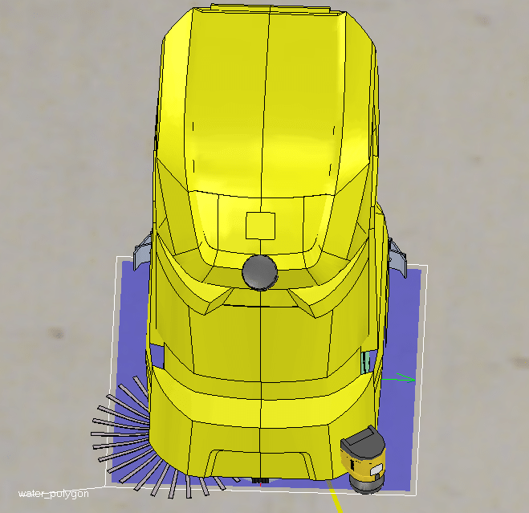

---

---

KIRA B50 Simulation

This project contains the `kira_b50` plugin for Coppelia Sim along with corresponding launch files, etc.


This project allows to simulate an environment and the low level perception and action layers of the robot. This enables us to run our cognition and application layer software in a controlled environment. The main benefits from that are

- Algorithms can be developed and tested without a HW setup
- Different scenarios can be setup automatically
- Experiments are repeatable and deterministic
- Algorithms can be analyzed in a "sterile" environment without sensor noise or wrong measurements, however fault injection can also be introduced in a controlled manner
- Integration tests for other nodes can be run against the simulation
- Concepts can be verified in simulation

## Installation

### Install Coppelia Sim

In order to install Coppelia Sim use our installation script from the [build_setup](https://git.app.kaercher.com/projects/PRE/repos/build_setup/browse) repository. After cloning run

```bash
build_setup/linux/extra_hooks/20_install_coppeliasim
```

the script will

- install Coppelia Sim Educational edition release into `/opt/coppeliasim` 
- Make `/opt/coppeliasim` writable by the current user (for plugin installation)
- set the environment variable `COPPELIA_SIM_ROOT` to `/opt/coppeliasim`

If you install Coppelia Sim manually, make sure that you set the environment variable yourself, otherwise CMake won't be able to find the Coppelia Sim installation and make sure the installation dir is modifiable, such that you can install plugins without administrative privileges.

By default the script will install the Coppelia Sim professional version. To use that you need to access a license server. Since this is not always possible there is a `-e` switch to the script which will install the Education version instead which can be used as a drop in replacement.

### Install KIRA B50 Plugin

In order to setup the kira workspace structure follow the instructions from the [kira main repository](https://git.app.kaercher.com/projects/IBR/repos/kira/browse). After you have set up the workspace successfully run: 

```bash
catkin build simulation
cd build/simulation/
make install  # this will put libv_repExtIbrSim.so to $COPPELIA_SIM_ROOT
```

## Running the simulation


### Launch Coppelia Sim

Coppelia Sim can be launched with [`sim.launch`](./launch/sim.launch). This launch file is highly configurable and allows to setup the simulation in plenty of different scenarios. E.g. you can start with the loaded KIRA B50 model in an arbitrary  scene at an predefined starting position. Also the sensor set used during the current experiment can be adjusted by enabling and disabling certain components.

##### Launch file parameters

```xml
<arg name="scene" default="$(find simulation)/scenes/rcc.ttt" doc="simulation scene"/>
<arg name="auto_start" default="true" doc="Start simulation automatically"/>
<arg name="headless" default="false" doc="Start simulation without visualization"/>
<arg name="use_sim_time" default="true" doc="Sim time will be used as ROS time master"/>
<arg name="tf_synch" default="true" doc="Synchronize component transformations according to tf"/>
<arg name="start_pose" default="[-11.0, -3.8, -1.57079632679 ]" doc="start pose of the robot in the selected scene [m, m, rad]"/>
<!-- currently supported components: imu, laser, uss, camera, differential_drive -->
<arg name="components" default="[imu,differential_drive,laser]"/>
<arg name="used_cameras" default="[front,right,left]"/>
<arg name="used_lasers" default="[front,back,cliff]"/>
<arg name="used_uss" default="[right,right_edge,front_right,front_left,left_edge,left]"/>
<arg name="aruco" default="$(find simulation)/config/aruco.yaml"/>
<arg name="visualization" default="true" doc="display sensor measurements in Coppelia" />

<param name="/use_sim_time" value="$(arg use_sim_time)" />
```

[`sim_setup.launch`](./launch/sim_setup.launch)

For manual control the `keyboard` node is handy sometimes. To launch it run `roslaunch kira_base keyboard.launch`. The node is not included into the sim launch file by default like `gamepad.launch` is, because the `keyboard` node needs exclusive ownership of the terminal it is running in, thus it is advised to start it in an own separate terminal window.

## Plugin Design

The main components provided by this package are

1. The actual Coppelia Sim 3D model, which you will find in `simulation/models` 

   

2. A collection of scenes (especially the virtual RCC) which you can find in `simulation/scenes`

   

   There is also an RCC scene version which contains cliffs: `simulation/scenes/rcc_with_cliff.ttt`

3. A Coppelia Sim plugin which ensures that the simulation offers the expected ROS interface in terms of messages and services. The plugin is the main build artifact of the `simulation` package.

We try to put all custom logic into the plugin, especially all ROS related features. The 3D model on the other hand is only used as a visualization. However this rule is broken sometimes, e.g. if you want to enable special filters for a particular sensor type, which are only available in the Coppelia Sim UI, such cases should be avoided whenever possible.

The following diagram shows the internal architecture of the KIRA Coppelia Sim plugin. The main class `PluginNode` manages several components which implement the `ComponentVirtualBase` interface. Each component is responsible for a particular part of the system, e.g. a sensor system or an actor and will provide the required ROS interface in terms of messages and services. 


In every major step of the simulation the following will take place:


1. `ros::spinOnce()` is called in order to ensure that all ROS messages enter the Coppelia Sim system
2. Every component which is registered for the given tick multiple is updated, other components are skipped
3. `ros::spinOnce()` is called again. This ensures that all messages published by the components during this tick are made available on the ROS message bus

### Features

Besides the components which are entities running at every simulation tick producing sensor measurements or forwarding commands to the simulation there are are some general features of the plugin which will be described in the following sections.

#### TF Synchronization

In a robotic system a large number of different coordinate systems which we typically call frames must be maintained. This information is typically stored in a [urdf](http://wiki.ros.org/urdf) File. For the KIRA B50 Robot the main urdf file can be found [here](https://git.app.kaercher.com/projects/IBR/repos/kira/browse/kira_config/robot/kira.urdf). The following image shows a visualization of some of the frames found in the KIRA B50 robot.


In Coppelia on the other hand the sensors and other parts of the robots also need to be positioned correctly such that their position and orientation relative to `base_link` match with the assumptions in the `urdf` file. 

To allow fast and easy synchronization between the `urdf` file and the sensor positions in the Coppelia Sim model, the plugin main class will update sensor positions of all components with respect to published `tf` transforms. In order to enable this feature strict naming conventions must be followed when adding new Coppelia Sim elements, i.e. the components which must be moved must be named like the corresponding `tf` link. 

#### Dynamic Model Loading

Coppelia Sim has no concept of a link to a model, instead a model is always saved as part of a scene. This can very easily lead to a situation where you have multiple versions of the robot model in different scenes. This is especially bad with regards to the fact that the plugin must rely on handle names or elements beeing available in the 3D model. To compensate this shortcoming dynamic model loading has beed added to the plugin main class. 

By default the model `kira_dev/simulation/models/kira_b50.ttm` is loaded at the start of the simulation. You can control which model gets loaded by setting the rosparam `sim/model_path`. The initial position of the model is controlled by the parameter `sim/start_pose`. After the simulation is stopped the model is removed from the scene, this ensures that the model is not saved as part of the scene by accident. 

If you add the model manually to the scene before starting the simulation, then the dynamic model loading will be skipped and the model will not be removed when the simulation stops. This is handy if you want to work on the model itself.

:warning::warning::warning:

Whenever a new scene is added to the collection make sure that the model is **not** saved as part of the scene. So remove the model from the simulation before saving the scene.

:warning::warning::warning:

#### Dynamic Sensor Loading

Addition of a new component to the  existing Coppelia Sim model always require addition, renaming, positioning  of the sensor and attaching it to the parent model be done manually in the Coppelia Sim simulation environment. To make this process simple, dynamic sensor loading is implemented.

For every dynamically enabled sensor a separate `.ttm` file is present which contains the actual 3D model of the sensor. To dynamically attach the sensor to the robot model, the launch file has to be adjusted accordingly. The concept is explained examplified by the lidar sensor.

For all dynamically enabled sensors a `used_<sensor-type>` argument exists. To add more sensors they have to be added to this list, e.g.:

```xml
<arg name="used_lasers" default="[front,front2,front3,front4,front5]"/>
```

Next for each added component the position, orientation and other sensor specific parameters have to be specified. This has to be done in the components sub namespace, e.g.

```xml
<group ns="laser">
    <rosparam param="lasers" subst_value="True">$(arg used_lasers) </rosparam>
    <param name="laser_path" value="$(find simulation)/models/laser.ttm"/>
    <param name="angle_min" value="-2.35619"/>
    <param name="angle_max" value="2.35619"/>
    <param name="intensity_min" value="10.0" />
    <param name="intensity_max" value="255.0" />
    <param name="visualization" value="$(arg visualization)" />
    <param name="rpy" value="[3.141592653589793,0,0]" type="yaml"/>

    <group ns="front">
        <param name="xyz" value="[0.60,0.0,0.0]" type="yaml"/>
    </group>
    <group ns="front2">
        <param name="xyz" value="[0.60,0.0,0.15]" type="yaml"/>
    </group>
    <group ns="front3">
        <param name="xyz" value="[0.60,0.0,0.3]" type="yaml"/>
    </group>
    <group ns="front4">
        <param name="xyz" value="[0.60,0.0,0.45]" type="yaml"/>
    </group>
    <group ns="front5">
        <param name="xyz" value="[0.60,0.0,0.6]" type="yaml"/>
    </group>
</group>
```

You can overwrite individual parameters by opening up an new subnamespace with the name of the new component. In the example above all lidars share the same common characteristics such as `min` and `max angle` and the orientation. However the position is adjusted individually for every sensor.

The result of the example configuration shown above would result in a sensor configuration shown in the following picture:


#### Simulation Time

When working with a non-real-time simulation you don't want to use the wall time as your time source. Instead the simulation time must be used. Refer to the [ROS Clock documentation](http://wiki.ros.org/Clock) for further details on that topic. The plugin basically ensures that Coppelia Sim acts as time master in the ROS framework, by publishing the simulation time as ros clock. The basic `sim.launch` launch file will also set the `/use_sim_time` rosparam to `true` by default. The simulation time will be published on the `/clock` topic ([rosgraph_msgs/Clock](http://docs.ros.org/api/rosgraph_msgs/html/msg/Clock.html)).

#### ROS name remapping

In order to enable remapping of ROS topics, services, etc inside the Coppelia Sim plugin a small workaround has been implemented. Remapping arguments are typically passed as command line arguments to the corresponding node executable. This is not possible in the case of the Coppelia Sim plugin, since it's a shared library, which will not receive any command line arguments. Thus the remapping arguments are passed to the python launcher which starts the simulation. The [usual remapping syntax](http://wiki.ros.org/Remapping%20Arguments) can be used there:

```xml
<node name="sim_launcher" pkg="simulation" type="sim"  output="screen">
    <remap from="odom" to="kira_base/odom"/>
    <remap from="scan" to="sick_safetyscanners/scan"/>
    <remap from="imu_raw" to="can_sensors/imu/data_raw"/>
    <remap from="sonar" to="can_sensors/sonar"/>
</node>
```

The launcher will then create a temporary `/tmp/sim_ros_remapping.json` file. For the example above the file would look like this:

```json
{
    "sonar": "can_sensors/sonar", 
    "imu_raw": "can_sensors/imu/data_raw", 
    "odom": "kira_base/odom", 
    "scan": "sick_safetyscanners/scan"
}
```

Before the simulation starts or even before the plugin internal ROS node is initialized, this file is parsed and the remapping arguments are passed to `ros::init`.

##### Current Remappings

**Coppelia Sim standard topic names are currently mapped to the topic names of the real robot.**

- `~/odom` &rarr; `/kira_base/odom`  
- `~/scan` &rarr; `/sick_safetyscanners/scan` 
- `~/imu_raw` &rarr; `/can_sensors/imu/data_raw`  
- `~/sonar` &rarr;  `/can_sensors/sonar`

#### Extended Remote API

Coppelia offers a [remote API](https://www.coppeliarobotics.com/helpFiles/en/remoteApiOverview.htm) which can be used to execute commands from external programs or scripts in order to interact with a running simulation. This feature is especially important for testing in order to setup dynamic test scenarios or to extract additional information to perform e.g. collision checks.

However the number of available remote functions is quite limited. Thus a secondary channel to perform remote procedure calls has been introduced. The kira_b50 plugin implements the [`kira_msgs::StringCommand`](https://git.app.kaercher.com/projects/IBR/repos/kira_shared/browse/kira_msgs/srv/StringCommand.srv) Service interface. Which is used to implement a simple [JSON RPC](https://www.jsonrpc.org/specification) based remote procedure call mechanism. 

To interact with this remote procedure call server within the plugin a puton module `tools/sim_utils/remote_api.py` has been implemented. It acts as an extended CoppeliaSim remote API client. On the one hand the normal Coppelia Remote Functions can be called through this module as well as the custom kira functions.

##### Remote Functions

The following section contains the documentation for currently implemented RPC calls

###### spawnPureShapeObstacle

Spawn an pure shape obstacle (e.b. a cuboid) with some user specified characteristics into the scene. This function is basically a combination of the following Coppelia Functions

- [`simCreatePureShape`](https://www.coppeliarobotics.com/helpFiles/en/regularApi/simCreatePureShape.htm)
- [`simSetObjectPosition`](https://www.coppeliarobotics.com/helpFiles/en/regularApi/simSetObjectPosition.htm)
- [`simSetObjectQuaternion`](https://www.coppeliarobotics.com/helpFiles/en/regularApi/simSetObjectQuaternion.htm)
- [`simSetObjectSpecialProperty`](https://www.coppeliarobotics.com/helpFiles/en/regularApi/simSetObjectSpecialProperty.htm)
- [`simSetShapeColor`](https://www.coppeliarobotics.com/helpFiles/en/regularApi/simSetShapeColor.htm)

In the official documentation you can find more information on the individual parameters. 

| Parameter              | Type     | Description                                                  |
| ---------------------- | -------- | ------------------------------------------------------------ |
| primitiveType          | int      | 0 for a cuboid, 1 for a sphere, 2 for a cylinder and 3 for a cone |
| options                | int      | Bit-coded: if bit0 is set (1), backfaces are culled. If bit1 is set (2), edges are visible. If bit2 is set (4), the shape appears smooth. If bit3 is set (8), the shape is respondable. If bit4 is set (16), the shape is static. If bit5 is set (32), the cylinder has open ends |
| sizes                  | float[3] | 3 values indicating the size of the shape                    |
| mass                   | float    | the mass of the shape                                        |
| relativeToObjectHandle | int      | indicates relative to which reference frame the position is specified. Specify -1 to set the absolute position. Specify -2 to spawn the obstacle relative to the robot. |
| position               | float[3] | coordinates of the object (x, y and z) [m]                   |
| quaternion             | float[4] | the quaternion (x,y,z,w)                                     |
| specialProperties      | int      | object special property. See the [object special property values](https://www.coppeliarobotics.com/helpFiles/en/apiConstants.htm#sceneObjectSpecialProperties). Combine them with the "or"-operator |
| color                  | float[3] | red, green and blue components of the color (3 values) between 0.0 and 1.0 |

| Return | Type | Description                                                 |
| ------ | ---- | ----------------------------------------------------------- |
| handle | int  | Handle to the newly spwned Obstacle or -1 in case of error. |

Example:

```json
// REQUEST
{
    "primitiveType": 0, 
    "options": 8, 
    "sizes": [1.0, 1.5, 0.5], 
    "mass": 100.0,
    "relativeToObjectHandle": -1,
    "position": [10.0, 0.0, 0.25],
    "quaternion": [0.0, 0.0, 0.0, 1.0],
    "specialProperties": 512,
    "color": [1.0, 0.8, 0.3]
}

// RESPONSE
{238}
```

###### getAvailableFunctions

In order to be sure that a given method is supported by the server version you are currently working with, you can call the `getAvailableFunctions` method, which will return a list of implemented methods

```json
// RESPONSE
[
    "getAvailableFunctions",
    "spawnPureShapeObstacle"
]
```

##### Parcour


Spawning dynamic obstacles into the simulation is a common operation for a lot of integration tests. Therefore a small tool `parcour` has been designed to simplify the task.

```
Utility for interacting with Coppelia Sim.
Allows to place obstacles to the current scene based on a scenario description file.
For complex setups use the file mode. Simple individual obstacles can be specified on the command line directly.

Usage:
    parcour -h | --help
    parcour [options] scenario <file>
    parcour [options] box [--xy_yaw <pose> | 
                           ([--xyz <position>] [--rpy <orientation>])] 
                          [--lwh <size>] [--color <col>]

Options:
    -h, --help              Show this help and exit
    -r, --relative          All coordinates are interpreted as relative to the roboter
                            base_ref, else sim coordinates

Commands: box:
    --xy_yaw <pose>       Two-dimensional pose for the box
    --xyz <position>      Three-dimensional position for the box
    --rpy <orientation>   Orientation in euler angles (ROS convention: zyx)
    --lwh <size>          Length, width and height of the box [default [1,1,1]]
    --color <col>         Color of the box, rgb hex code or some common name 
                          [default: grey]
```

Complex scenarios can be formulated using a yaml file with the schema shown below

```
obstacles:
  - name: box1
    type: box
    xyz: [0, 0, 0.5]
    rpy: [0, 0, 0]
    lwh: [1, 1, 1]
    color: red

  - name: box2
    type: box
    xyz: [0, 0, 0.5]
    rpy: [0, 0, 0.9]
    lwh: [4, 1, 1]
    color: ffff00
```

#### ArUco Codes

The visual markers  are integrated into CoppeliaSim simulation environment.This enables the development of the detection algorithms and landmark application functionality using the simulation.


By enabling the `camera` component the markers can then be detecting using a dedicated detection package (e.g. [aruco_detect](http://wiki.ros.org/aruco_detect)).


To place ArUco codes into a scene a config file with a description of the markers has to be passed to the simulation via the `aruco` parameter. The schema of the maker config file is shown below

``` yaml
# general options
marker_size: [0.118, 0.118]

# an array of markers -> a marker is placed into the scene for each entry
markers:
- code: 0
  xyz: [-2.11, 8.88, 0.63]
  rpy: [1.45663929, 1.404402614, 1.698544621]
- code: 23
  xyz: [20.27500153, 3.354001045, 0.5470001698]
  rpy: [1.511592865, 0.019, 0.0268]

```

### Cleaning

In order to visualize the cleaning service of Kira B50, the cleaning feature is implemented in Coppeliasim simulation environment. Each cleaning gadgets will be enabled depending upon the service request. For an example, a plane polygon will be created and placed under the Kira 50, when there is a request for water(100%) as shown in the below figure. 



The activation of all cleaning gadgets(brush,broom,water and detergent) at the same time with

the varying broom speed, amount of water and detergent. 


### Components

The following section describes the component design in a greater detail. In general it's almost impossible to avoid coupling between the plugin code and the actual 3D model. In order to keep the coupling low and clear we decided to structure the plugin in individual components. So then if explicit knowledge about the name of a specific Sim handle is needed, this knowledge is encapsulated in a single component.

![(/home/pre/Downloads/recording_2020_05_09-13_10-41.gif)The simulation can be configured such that only components that you need are loaded. In order to select components set the ROS parameter `/sim/components` to a list of strings with the names of the components you want to load, e.g. `[clock, imu, differential_drive, sick_laser]` would be a minimal set for SLAM experiments.

For any given components its parameter namespace will be `/sim/<component_name>/`.

#### Differential Drive

The `differential_drive` component provides a low level motion interface which allows to move the robot in the the simulated environment and provides a feedback. 

##### Parameters

###### `~/dependent_omega`: bool

This is a quite important parameter which drastically alters the behavior of the velocity filter. When the parameter is `false` an individual filter is used for omega and v, thus the resulting curvature of the smoothed path will not necessarily be equal to the orimage-20200509130546002iginal path curvature. On the other hand if the mode toggle is set to `true` only v is filtered, and omega is computed based on the current path curvature, knowing that $\omega = v*\kappa$ holds. This however also means that the constraints `~/max_acc/angular` and `~/max_jerk/angular` will be ignore, i.e. jumps in the commanded path curvature, will lead to jumps in the commanded angular velocity. If the commanded path is sufficiently smooth, i.e. it does not contain large sudden curvature changes, the second option (`dependent_omega = true`) will lead to a better path following behavior.

###### `start_pose` : tuple (x, y) [m, m]

Will be typically set by the launch file according to the global `/sim/start_pose` parameter.

###### `max_vel/linear`: float [m/s]

###### `max_vel/angular`: float [rad/s]

###### `max_acc/linear`: float [m/s²]

###### `max_acc/angular`: float [rad/s²]

###### `max_jerk/linear`: float [m/s³]

###### `max_jerk/angular`: float [rad/s³]

All of the above are constraints for the internally used twist filter. Which behaves like [kira_base](<https://git.app.kaercher.com/projects/IBR/repos/kira_driver/browse/kira_base>). Also the twist filter can be parametrized at run time using dynamic reconfigure, therefore the parameter set [`kira_msgs::TwistFilter`](https://git.app.kaercher.com/projects/IBR/repos/kira_shared/browse/kira_msgs/cfg/TwistFilter.cfg) is used.


##### Subscribed Topics

###### `/cmd_vel` ([geometry_msgs/Twist](http://docs.ros.org/api/geometry_msgs/html/msg/Twist.html))

A stream of velocity commands meant for execution by a mobile base. 

##### Published Topics

###### `~/odom` ([nav_msgs/Odometry](http://docs.ros.org/melodic/api/nav_msgs/html/msg/Odometry.html))

Position and velocity estimation. Currently this is implementing by adding a dummy object `odom` at start of the simulation at the position of the robot base link. 


This dummy reference is than used to get the position of the robot base relative to this starting position using the internal Coppelia Sim api function [`simGetObjectPosition`](http://www.coppeliarobotics.com/helpFiles/en/regularApi/simGetObjectPosition.htm) (and the orientation respectively [simGetObjectQuaternion](http://www.coppeliarobotics.com/helpFiles/en/regularApi/simGetObjectQuaternion.htm)). 

:exclamation: This approach will fail if the robot performs non planar motion, since a typical odometry measurement does not reflect changes in z direction, whereas this approach does. 

#### IMU

In Coppelia Sim two simulated sensors are needed to build an inertial measurement unit: an accelerometer and a gyroscope. The `imu` plugin components reads both sensors and publishes them on a single topic.


##### Published Topics

###### `~/imu_raw` ([sensor_msgs/Imu](http://docs.ros.org/melodic/api/sensor_msgs/html/msg/Imu.html))

Currently does not provide an orientation measurement and covariances.

#### Ultrasonic

The ultrasonic component controls all ultrasonic sensors in Coppelia Sim. Ultrasonic sensors are modeled in a special way in Coppelia Sim as you can see in the following pictures:


Each modeled sensor consists of 7 Coppelia Sim proximity sensors. This is done in order to allow some parametrization of the field of view via ROS parameters, such that experiments with different ultrasonic cone sizes become possible.

In theory this could be achieved by modifying the  `Angle` parameter in the [Detection Volume Dialog](http://www.coppeliarobotics.com/helpFiles/en/proximitySensorVolumeDialog.htm) of the corresponding proximity sensor. 


However those values are not accessible through the API and thus can not be easily synchronized with ROS parameter settings. As a workaround the above shown concept was developed, where each ultrasonic sensors basically has 7 layers. Where the outer most layer has a field of view angle of 90°, the second one 80° and so on up to the inner most layer with a cone angle of 30°. In order to prevent strange effects at layer boundaries the individual cone shapes have a small overlap, i.e. the outer layer has an outer angle of 90° but an inner angle of 79° instead of 80°. The `Inside gap` parameter is used to add a hole to the volume of the proximity sensors cone. Keep in mind that the Coppelia Sim documentation is misleading in regard to this parameter: the `Inside gap` **does not** represent the amount of volume (proportionally) to remove. Instead it's directly proportional to the cone angle. Clearly this is not the same for a cone shape. 

By applying this technique the field of view parameter can be selected from the range [90, 30]. Applying the parameter will disable a corresponding number of outer layers yielding a smaller resulting cone. Naturally the parameter will be rounded to a multiple of 10°, so arbitrary field of view angles are not possible at the moment. 

In the plugin all active layers of the sensor are evaluated and the minimum measured range value is what gets propagated as the content of the published [sensor_msgs/Range](http://docs.ros.org/melodic/api/sensor_msgs/html/msg/Range.html) message.

Note: In future this multi proximity sensor approach could also be used to build more sophisticated cone shapes (e.g. large angle in the near field and smaller angle in the distance).

##### Parameters

###### `field_of_view` float in radians

Sonar cone opening angle. Will be rounded to steps of 10°, whereby 30° is the minimum and 90° is the maximum settable angle.

##### Published Topics

###### `~/sonar` ([sensor_msgs/Range](http://docs.ros.org/melodic/api/sensor_msgs/html/msg/Range.html))

#### Camera

The camera component will manage all cameras in the Coppelia Sim model. The Simulation provides 2D images for every camera as well as 3D PointClouds as shown in the example below


##### Parameters

###### `sim/camera/cameras` (list of strings)

The names of active cameras, whereby active means the component will read the image for this camera and publish corresponding ROS topics. Keep in mind that enabling all cameras is very computation heavy, this is why an easy way to enable/disable individual cameras was added. Currently supported values are:

- `camera_front`
- `camera_right`
- `camera_left`

##### Published Topics

For every enabled camera `<cam>` there will be a pair of topics:

###### `~/<cam>/depth/color/points` ([sensor_msgs/PointCloud2](http://docs.ros.org/melodic/api/sensor_msgs/html/msg/PointCloud2.html))
###### `~/<cam>/color/image_raw` ([sensor_msgs/Image](http://docs.ros.org/melodic/api/sensor_msgs/html/msg/Image.html))
###### `~/<cam>/color/CameraInfo` ([sensor_msgs/CameraInfo](http://docs.ros.org/melodic/api/sensor_msgs/html/msg/CameraInfo.html))
###### `~/<cam>/depth/CameraInfo` ([sensor_msgs/CameraInfo](http://docs.ros.org/melodic/api/sensor_msgs/html/msg/CameraInfo.html))

The  cameras in coppeliaSim are adjusted to real camera's field_of_view and resolution.

#### Laser Scanner

An arbitrary number of laser scanners with different characteristics can be loaded. The here provided laser model which is stored in `models/laster.ttm` resembles a sick laser with a maximum field of view of 270°.


The resolution used by the laser is currently hard coded to 512x1.

##### Intensity

In order to simulate the docking reflector marker detection some way to compute an intensity value along with the range measurements.

A real intensity simulation based on objects reflexivity characteristics is out of scope and also not possible with Coppelia Sim. A simple way to achieve this is to use the color information provided by the Vision Sensor. The fist approach was to extract the lightness factor from every color and use that directly. This did not work well, so another approach was considered.

A special renderer is used in the Laser Sensors which will return the auxiliary color channel instead of the default one. By default objects have a dark grey color on this channel. Then a marker, which is basically a detectable Plane in Coppelia with white as auxiliary color is created. As we can see on the view in the screen shot, in the laser image three white stripes can be distinguished clearly.


To achieve this result the settings in the laser must be chosen as shown below.


Escpecialy the auxiliary renderer and the unchecked "Ignore RGB info" are important. Then in the sensors vision callback script we perform the following transformation on the image:

```lua
simVision.sensorImgToWorkImg(inData.handle)
simVision.intensityScaleOnWorkImg(inData.handle, 0.0, 1.0, true)
```

In the plugin code we then can  extract the greyscale intensity image with

```c++
SmartBuffer<float> image = simGetVisionSensorImage(laserHandle +
                                                   sim_handleflag_greyscale);
```

:warning: Whenever you work with Coppelia image buffers keep in mind that they go from left to right, whereas for the lidar we go in the positive angle direction i.e. from right to left.

:warning: Intensities are extracted from the 2D image and ranges from a 3D image. This means that the 3D ray needs to be projected onto the image plane using the intercept theorem in order correctly assign intensity values to the measured distances.

##### Parameters

###### `lasers` (list of used lasers)

Uses dynamic sensor loading as described above. A new laser is inserted for every element in the list.

###### `visualization` bool

Enable or disable the drawing of laser rays in Coppelia.

###### `intensity_min` float

Minimum intensity value. The greyscale intensity is transformed using the formula: `intensity = (intensity_max - intensity_min)*greyscale + intensity_min`. Default: 10.0.

###### `intensitiy_max` float

Maximum intensity value. The greyscale intensity is transformed using the formula: `intensity = (intensity_max - intensity_min)*greyscale + intensity_min`. Default: 255.0.

###### `sim/laser/angle_min` (float in radian)

###### `sim/laser/angle_min` (float in radian)

Min and max angles of the resulting laser scan message. Thereby ROS follows the following convention:


The parameters will be also used to control the visualization in Coppelia Sim.

The min/max angle parameters can also be pushed one namespace below, e.g. `sim/laser/horizontal_laser/angle_min` then the setting will apply only to `horizontal_laser`. This allows having different settings for the individual laser sensors.

###### `sim/laser/xyz` (3 value list of floats [m])

Sensor position relative to `base_link`. Will be overwritten through the `tf_synch` when enabled.

###### `sim/laser/rpy` (3 value list of floats [rad])

Sensor rotation relative to `base_link` (zyx order). Will be overwritten through the `tf_synch` when enabled.

##### Published Topics

###### `~/scan` ([sensor_msgs/LaserScan](http://docs.ros.org/melodic/api/sensor_msgs/html/msg/LaserScan.html))

When multiple lasers are used, there will be multiple scan topics, whereby the fist will have the name `/scan` the second will be `/scan1`, then `/scan2` and so on.


## Working with the simulation

### Debugging the plugin

When adding new components to the plugin or modifying existing ones you will often want to debug the plugin. The following guide shows how this can be achieved when working with QtCreator.

1. In the file  `/etc/sysctl.d/10-ptrace.conf` set the value of `kernel.yama.ptrace_scope` to `0` which will allow you to attach the debugger to running applications. This is a permanent change which will take action after a relogin. In order to change this setting immediately (or for a single session) use `echo 0 | sudo tee /proc/sys/kernel/yama/ptrace_scope`

2. In the build settings make sure that `CMAKE_BUILD_TYPE` is set to `Debug`

   

3. Make sure that you have deployed the plugin built with debug information.

4. Set a breakpoint

5. In QtCreator go to `Debug`>`Start Debugging`> `Attach to unstarted application`. In the following dialog select the `coppeliaSim` executable as shown below

   

6. Run your launch file. The execution should halt at your breakpoint allowing you to continue the execution step by step.
